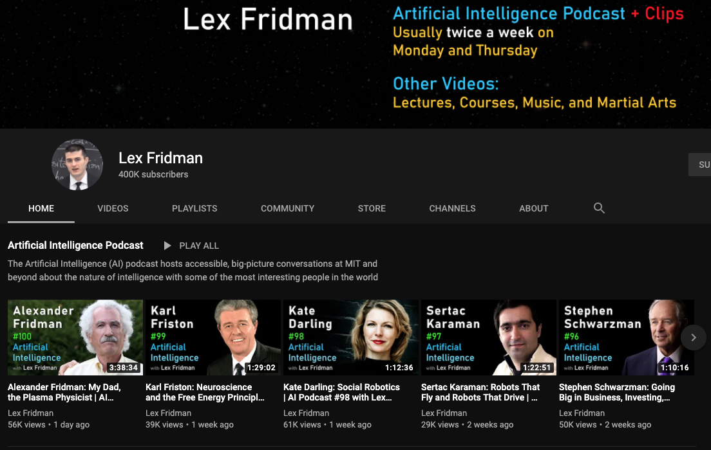

```{r xaringan-themer, include = FALSE}
library(xaringanthemer)
mono_light(
  base_color = "midnightblue",
  header_font_google = google_font("Josefin Sans"),
  text_font_google   = google_font("Montserrat", "500", "500i"),
  code_font_google   = google_font("Droid Mono"),
  link_color = "#8B1A1A", #firebrick4
  text_font_size = "28px"
)
```

## Final project

The objectives of this class include  
- Become proficient in selecting the correct types of deep learning models
- Implement deep neural networks using Keras/TensorFlow and R programming language
- Train and evaluate the performance of deep neural networks

To help you with this, you will solve one of the [Kaggle competitions](https://www.kaggle.com/datasets) based on topics/code learned in-class. See [Final project](class/final_project) for more details

- Teams of two are encouraged
- Due date is 07/12/2020

.small[https://www.kaggle.com/datasets]

---
## Final project

Examples of Kaggle competitions


.small[https://www.kaggle.com/datasets]


<!--
### Artificial Intelligence Podcast

.center[
<a href="https://www.youtube.com/user/lexfridman/featured">  </a>
]

.small[https://www.youtube.com/user/lexfridman/featured]
-->