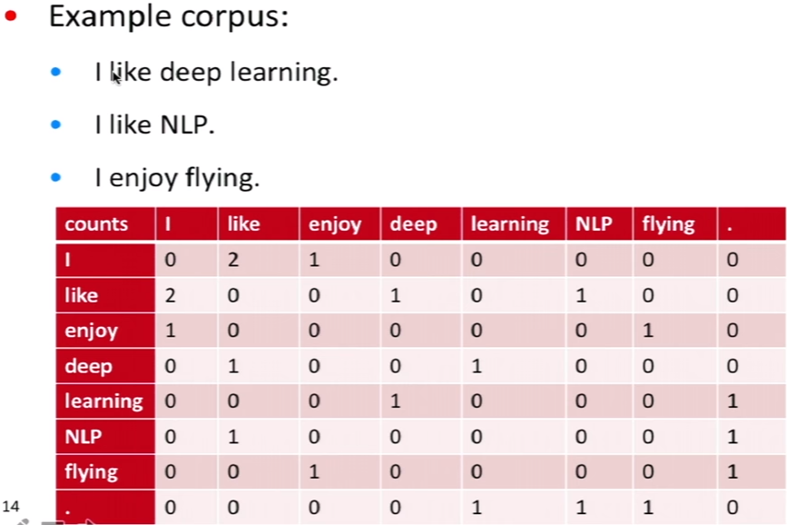

```{r xaringan-themer, include = FALSE}
library(xaringanthemer)
mono_light(
  base_color = "midnightblue",
  header_font_google = google_font("Josefin Sans"),
  text_font_google   = google_font("Montserrat", "500", "500i"),
  code_font_google   = google_font("Droid Mono"),
  link_color = "#8B1A1A", #firebrick4, "deepskyblue1"
  text_font_size = "28px"
)
```

## Text processing

Sequential data - best processed with RNNs, 1D CNNs

- Document classification and time series classification, such as identifying the topic of an article or the author of a book
- Timeseries comparisons, such as estimating how closely related two documents or two stock tickers are
- Sequence-to-sequence learning, such as decoding an English sentence into French
- Sentiment analysis, such as classifying the sentiment of tweets or movie reviews as positive or negative
- Timeseries forecasting, such as predicting the future weather at a certain location, given recent weather data

---
## Text preparation

- Vectorizing text is the process of transforming text into numeric tensors

- Tokenization is breaking text into tokens (words, characters, or n-grams)
    - One-hot encoding
    - Word embedding

- Vocabulary - the set of unique tokens in the corpus

.small[https://www.analyticsvidhya.com/blog/2020/05/what-is-tokenization-nlp/]

---
## Word Tokenization

- Word Tokenization is the most commonly used tokenization algorithm. It splits a piece of text into individual words based on a certain delimiter

- Depending upon delimiters, different word-level tokens are formed

- Typically the top K frequent words are used, and the rare words are replaced with a "UNK" token (placeholder for unknown)

- Pretrained Word Embeddings such as Word2Vec and GloVe comes under word tokenization

- Drawbacks - the vocabulary can become very large, the structure of individual words in not captured

---
## Character Tokenization

- Character Tokenization splits apiece of text into a set of characters

- Preserves the information of the word

- Limits the size of the vocabulary

- Drawbacks - the relationship between the characters to form meaningful words can be challenging to learn

- A compromise is to use Subword Tokenization that splits the piece of text into subwords (or n-gram characters)

.small[https://www.analyticsvidhya.com/blog/2020/05/what-is-tokenization-nlp/]

---
## One-hot encoding 

.center[]

.small[https://www.kaggle.com/dansbecker/using-categorical-data-with-one-hot-encoding]

---
## Word embedding

- Vectors obtained through one-hot encoding are binary, sparse (~99\% zeros), and very high-dimensional (same dimensionality as the number of words in the vocabulary, e.g., 20,000)

- Word embeddings are low-dimensional floating-point vectors (that is, dense vectors, of $2^x$ dimensions)

- A word embedding is a learned representation for text where words with the same meaning have a similar representation

---
## Embedding layer - de novo learning

- Embedding layer is a word embedding that is learned jointly with a neural network model on a specific natural language processing task, such as language modeling or document classification

- Instead of simple but huge and sparse one-hot-encoding vectors, we can use an embedding matrix of lower dimensionality (30-50 dimensions)

.small[https://www.tensorflow.org/tutorials/text/word_embeddings

https://machinelearningmastery.com/what-are-word-embeddings/]

---
## Embedding layer - de novo learning

- Initially, the weights for the embedding are randomly initialized. During training, they are gradually adjusted via backpropagation

- Once trained, the learned word embeddings will roughly encode similarities between words (as they were learned for the specific problem your model is trained on). This word embedding structure can be used by the downstream model

.small[https://www.tensorflow.org/tutorials/text/word_embeddings

https://machinelearningmastery.com/what-are-word-embeddings/]

---
## Embedding layer

The embedding matrix captures similarity among words in a multi-dimensional space. It can be visualized using dimensionality reduction techniques like t-SNE

.center[]

.small[https://towardsdatascience.com/deep-learning-4-embedding-layers-f9a02d55ac12]

---
## Word2Vec

- Word2Vec is a statistical method for efficiently learning a standalone word embedding from a text corpus

- It was developed by Tomas Mikolov, et al. at Google in 2013 as a response to make the neural-network-based training of the embedding more efficient, and since then has become the de facto standard for developing pre-trained word embedding

- Word vectors formed so that if we do a dot product between two different vectors, the result will tell us how similar two words are

- Such vectors capture the context of words (skip-gram and continuous bag of words methods)

.small[https://code.google.com/archive/p/word2vec/]

---
## Word co-occurrence

.center[]

Dimensionality can be reduced using SVD ( singular value decomposition). We then use the result of SVD as our word vectors

.small[https://leonardoaraujosantos.gitbooks.io/artificial-inteligence/content/natural-language-processing/word2vec.html]

---
## GloVe - reuse an embedding

- Global Vectors for Word Representation (GloVe) is an unsupervised learning algorithm for obtaining vector representations for words
- An extension to the Word2Vec method for efficiently learning word vectors, developed by Pennington, et al. at Stanford

- Training is performed on aggregated global word-word co-occurrence statistics from a corpus, and the resulting representations showcase interesting linear substructures of the word vector space

.small[https://nlp.stanford.edu/projects/glove/]

---
## GloVe - reuse an embedding

- Instead of SVD, the goal is to minimize a new loss function between $u$ and $v$ word vectors

$$J(\Theta) = \frac{1}{2} \sum_{i,j=1}^W f(P_{ij})(u_i^Tv_j -logP_{i,j})^2$$

- The training objective of GloVe is to learn word vectors such that their dot product equals the logarithm of the words’ probability of co-occurrence

.small[https://nlp.stanford.edu/projects/glove/]
