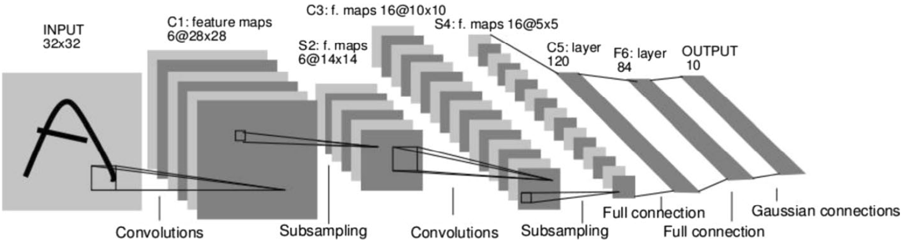
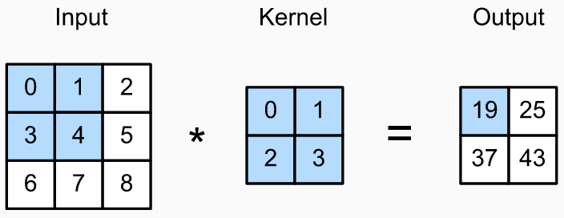
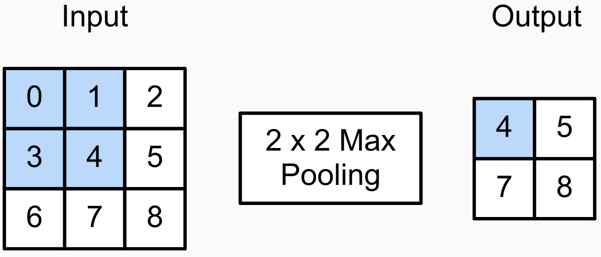
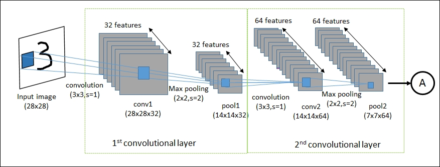
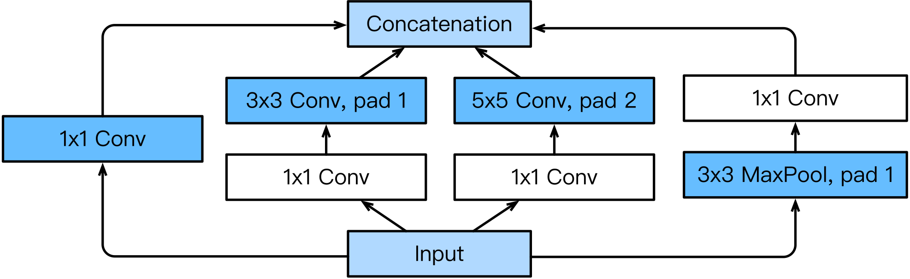
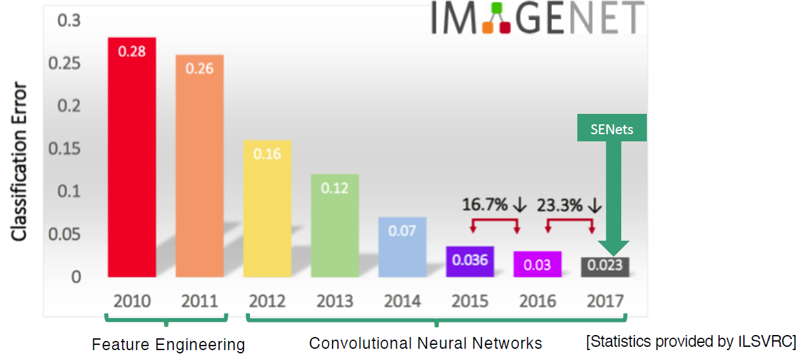
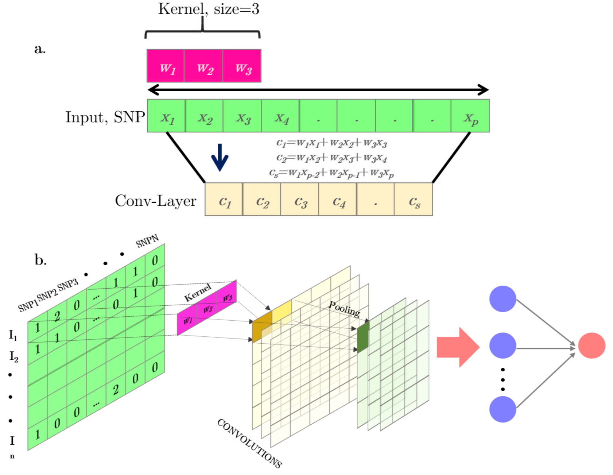

```{r xaringan-themer, include = FALSE}
library(xaringanthemer)
mono_light(
  base_color = "midnightblue",
  header_font_google = google_font("Josefin Sans"),
  text_font_google   = google_font("Montserrat", "500", "500i"),
  code_font_google   = google_font("Droid Mono"),
  link_color = "#8B1A1A", #firebrick4, "deepskyblue1"
  text_font_size = "28px"
)
```

## Convolutional Neural Networks (CNNs)

- The convolutional neural network (CNN) is a specialized feedforward neural network designed to process multi-dimensional data, e.g., images
- A CNN architecture is typically comprised of **convolutional layers**, **pooling** (subsampling) layers, and fully-connected layers (LeNet-5)

.center[]

.small[Lecun Y, Bottou L, Bengio Y, Haffner P. [Gradient-based learning applied to document recognition](https://ieeexplore.ieee.org/document/726791). Proc IEEE. 1998]

---
## Image classification using CNNs

- **MNIST** (Modified National Institute of Standards and Technology) - hand-written digits, 0-9. 60,000 28x28 pixels black-and-white images

- **CIFAR 10** (Canadian Institute For Advanced Research) - 60,000 32x32 pixels color images, 10 classes (airplane, automobile, bird, cat, deer, dog, frog, horse, ship, truck)

- **ImageNet** - over 14 million images, 20,000 categories (animals, plants, sports, etc.)

.small[https://www.analyticsvidhya.com/blog/2020/02/learn-image-classification-cnn-convolutional-neural-networks-3-datasets/

http://rodrigob.github.io/are_we_there_yet/build/classification_datasets_results.html]

---
## Convolution

- A CNN is a special case of neural networks which uses **convolution** instead of full matrix multiplication in the hidden layers
- In each convolutional layer, a convolutional operation is performed along with the input of predefined width and strides. Each of these convolutional operations is called a "**kernel**" or a "**filter**" and is somewhat equivalent to a "neuron" in an MLP An activation function is applied after each convolution to produce the output

---
## Pooling

- Finally, an operation called "**pooling**" is usually applied to smooth out the result. It consists of merging the kernel outputs of different successive positions by taking the maximum (**max-pooling**) of all values of those positions

- One of the main advantages of convolutional networks is their capability to reduce the number of parameters to be estimated. These networks also have sparse interactions and are equivariant to translations

---
## Convolution operation

- A single unit of a convolutional layer is only connected to a small receptive field of its input, where the weights of its connections define a **filter**
- The convolution operation is used to slide the filter bank across the input, producing activations at each receptive field that combine to form a **feature map**

.center[]

.small[https://d2l.ai/chapter_convolutional-neural-networks/conv-layer.html]

---
## Convolution operation

.center[]

Two-dimensional cross-correlation operation. The shaded portions are the first output element and the input and kernel array elements used in its computation: $0\times0 + 1\times1 + 3\times2 + 4\times3=19$

.small[https://d2l.ai/chapter_convolutional-neural-networks/channels.html]

---
## Parameters defining convolution

Convolutions are defined by two key parameters:

- **Size of the filters** extracted from the inputs. These are typically $3\times3$ (most frequently used), or $5\times5$

- **Depth of the output feature map** - The number of filters computed by the convolution

A convolution works by sliding these filters over the 3D input feature map, stopping at every possible location, and extracting the 3D patch of surrounding features 

---
## Pooling

- Max pooling consists of extracting windows from the input feature maps and outputting the max value of each channel

- It’s conceptually similar to convolution, except that instead of transforming local patches via a learned linear transformation (the convolution kernel), they’re transformed via a hardcoded $max$ tensor operation

- A big difference from convolution is that max-pooling is usually done with $2\times2$ windows and stride 2, to downsample the feature maps by a factor of 2

---
## Pooling

- The reason to use downsampling via max-pooling is to reduce the number of feature-map coefficients to process and to induce spatial-filter hierarchies by making successive convolution layers look at increasingly large windows

- **Max** is used because it’s more informative to look at the maximal presence of different features

.center[]

.small[https://deeplizard.com/learn/video/ZjM_XQa5s6s, https://d2l.ai/chapter_convolutional-neural-networks/pooling.html]

---
## Convolutional Neural Networks (CNNs)

- By combining multiple filter banks in a single convolutional layer, the layer can learn to detect multiple features in the input. The resulting feature maps become the input of the next layer
- A first convolution layer will learn small local patterns such as edges, a second convolution layer will learn larger patterns made of the features of the first layers, and so on

.center[]

.small[LeCun Y, Bengio Y, Hinton G. [Deep learning](https://www.nature.com/articles/nature14539). Nature. 2015

A friendly introduction to Convolutional Neural Networks and Image Recognition, 32m https://youtu.be/2-Ol7ZB0MmU]

---
## Convolutional Neural Networks (CNNs)

- Pooling layers are added after one or more convolutional layers to merge semantically similar features and reduce the dimensionality
- After the convolutional and pooling layers, the multi-dimensional output is flattened and fed to fully-connected layers for classification

.center[]

.small[LeCun Y, Bengio Y, Hinton G. [Deep learning](https://www.nature.com/articles/nature14539). Nature. 2015

A friendly introduction to Convolutional Neural Networks and Image Recognition, 32m https://youtu.be/2-Ol7ZB0MmU]

---
## Padding

To get an output feature map with the same spatial dimensions as the input, you can use padding

- **Padding** - adding an appropriate number of rows and columns on each side of the input feature map to make it possible to fit center convolution windows around every input tile

Review Figures 5.5 and 5.6 from the book

---
## Strides

- The other factor that can influence output size is the notion of strides
- The distance between two successive windows is a parameter of the convolution, called its stride, which defaults to 1
- It is possible to have strided convolutions: convolutions with a stride higher than 1.

Review Figure 5.7 from the book

---
## Depth-wise separable convolution layers

.pull-left[
- Implemented as `layer_separable_conv_2d()`

- Performs a spatial convolution on each channel of its input, independently, before mixing output channels via a pointwise convolution (a $1 \times 1$ convolution)

- It requires significantly fewer parameters and involves fewer computations, thus resulting in smaller, speedier models
]

.pull-right[]

.small[https://towardsdatascience.com/review-xception-with-depthwise-separable-convolution-better-than-inception-v3-image-dc967dd42568]

---
## Data augmentation

- Given infinite data, your model would be exposed to every possible aspect of the data distribution at hand: you would never overfit

- Data augmentation takes the approach of generating more training data from existing training samples, by augmenting the samples via a number of random transformations that yield believable-looking images

- The goal is that at training time, your model will never see the exact same picture twice. This helps expose the model to more aspects of the data and generalize better

---
## Data augmentation

- `rotation_range()` is a value in degrees (0–180), a range within which to randomly rotate pictures

- `width_shift()` and `height_shift()` are fractions of total width or height within which to randomly translate pictures vertically or horizontally

- `shear_range()` is for randomly applying shearing transformations

- `zoom_range()` is for randomly zooming inside pictures

- `horizontal_flip()` is for randomly flipping half the images horizontally

- `fill_mode()` is the strategy used for filling in newly created pixels, which can appear after a rotation or a width/height shift

---
## Visualizing what CNN learns

- Visualizing intermediate convnet outputs (intermediate activations) - Useful for understanding how successive convnet layers transform their input, and for getting a first idea of the meaning of individual convnet filters

- Visualizing convnets filters - Useful for understanding precisely what visual pattern or concept each filter in a convnet is receptive to

- Visualizing heatmaps of class activation in an image - Useful for understanding which parts of an image were identified as belonging to a given class, thus allowing you to localize objects in images

---
## Evolution of CNNs

- [LeNet5](http://yann.lecun.com/exdb/lenet/) - handwritten digit recognition, developed by Yann Lecun in the 90s. Two convolutional layers, two fully-connected hidden layers, and one fully-connected output layer, sigmoid activation function

.center[]

- [AlexNet](https://en.wikipedia.org/wiki/AlexNet) - ImageNet classification winner, developed by [Alex Krizhevsky in 2012](https://papers.nips.cc/paper/4824-imagenet-classification-with-deep-convolutional-neural-networks). Five concolutional layers, two fully-connect ed hidden layer, and one fully-connected output layer, ReLU activation function

.small[http://www.image-net.org/index

https://qz.com/1034972/the-data-that-changed-the-direction-of-ai-research-and-possibly-the-world/]

---
## Evolution of CNNs

- **VGG networks** developed by the [Visual Geometry Group](http://www.robots.ox.ac.uk/~vgg/)
    - Introduced block concept -  a sequence of the following layers: (i) a convolutional layer (with padding to maintain the resolution), (ii) a nonlinearity such as a ReLU, (iii) a pooling layer such as a max-pooling layer

- **VGG-11** - 8 convolutional layers (wrapped into 5 convolutional blocks) and 3 fully-connected layers

- **VGG-16**, **VGG-19** - deeper architectures

---
## GoogLeNet

- [GoogLeNet](https://leonardoaraujosantos.gitbooks.io/artificial-inteligence/content/googlenet.html) - ImageNet classification winner, developed by [Christian Szegedy in 2014](https://arxiv.org/abs/1409.4842). The concept of **inception block**

.center[]

.small[https://d2l.ai/chapter_convolutional-modern/googlenet.html

https://datascience.stackexchange.com/questions/14984/what-is-an-inception-layer]

---
## Inception block

- The inception block consists of four parallel paths
    - The first three paths use convolutional layers with window sizes of $1\times1$,  $3\times3$, and $5\times5$ to extract information from different spatial sizes
    - The middle two paths perform a $1\times1$ convolution on the input to reduce the number of input channels, reducing the model’s complexity
    - The fourth path uses a $3\times3$ maximum pooling layer, followed by a $1\times1$ convolutional layer to change the number of channels. The four paths all use appropriate padding to give the input and output the same height and width
    - Finally, the outputs along each path are concatenated along the channel dimension and comprise the block’s output

.small[https://d2l.ai/chapter_convolutional-modern/googlenet.html]

---
## Evolution of CNNs

- ResNet - ImageNet classification winner, developed by [Kaiming He in 2015](https://arxiv.org/abs/1512.03385)
- DenseNet - another winner, developed by [Gao Huang in 2017](https://arxiv.org/abs/1608.06993)

.center[]

.small[https://devopedia.org/imagenet

https://towardsdatascience.com/review-senet-squeeze-and-excitation-network-winner-of-ilsvrc-2017-image-classification-a887b98b2883]

---
## Using pre-trained network

- A pre-trained network is a saved network previously trained on a large dataset, typically on a large-scale image-classification task

- If this original dataset is large enough and general enough, then the spatial hierarchy of features learned by the pre-trained network can effectively act as a generic model of the visual world

- Its features can prove useful for many different computer-vision problems, even though these new problems may involve completely different classes than those of the original task. 

---
## Using pre-trained network

- CNNs comprise two parts: they start with a series of pooling and convolution layers, and they end with a densely connected classifier

- The first part is called the convolutional base

- The second part is the densely connected layers

- The representations learned by the convolutional base are likely to be more generic and therefore more reusable: the feature maps of a convnet are presence maps of generic concepts over a picture

- The densely connected layers utilize those representations to learn specific properties of the new input

---
## Two ways of using a pre-trained network

- Running the convolutional base over your dataset, recording its output to an array on disk, and then using this data as input to a standalone, densely connected classifier
    - Very fast, but prone to overfitting because data augmentation not possible

---
## Two ways of using a pre-trained network

- Extending the model you have (`conv_base`) by adding dense layers on top and running the whole thing end-to-end on the input data
    - Possible only on GPU, can use data augmentation, less prone to overfitting
    - Need to freeze the `conv_base` (preventing their weights from being updated during training)
    - Unfrozen weights (typically, last layers of `conv_base`) after the initial training with frozen weights allow for fine-tuning the performance (slight adjustment of representations in `conv_base`)


---
## Using pre-trained network

The list of image-classification models (all pre-trained on the ImageNet dataset) that are available as part of Keras:

- Xception
- Inception V3
- ResNet50
- VGG16
- VGG19
- MobileNet

---
## Convolutional Neural Network in genomics

.pull-left[
A simple scheme of a one-dimension (1D) convolutional operation (a). Full representation of a 1D convolutional neural network for an SNP-matrix (b). The convolution outputs are represented in yellow. Pooling layers after convolutional operations combining the output of the previous layer at certain locations into a single neuron are represented in green. The final output is a standard MLP
]

.pull-right[

]

.small[Pérez-Enciso and Zingaretti, “[A Guide for Using Deep Learning for Complex Trait Genomic Prediction](https://www.mdpi.com/2073-4425/10/7/553).”  

Convolution layer animation and math, https://www.analyticsvidhya.com/blog/2020/02/mathematics-behind-convolutional-neural-network/]

