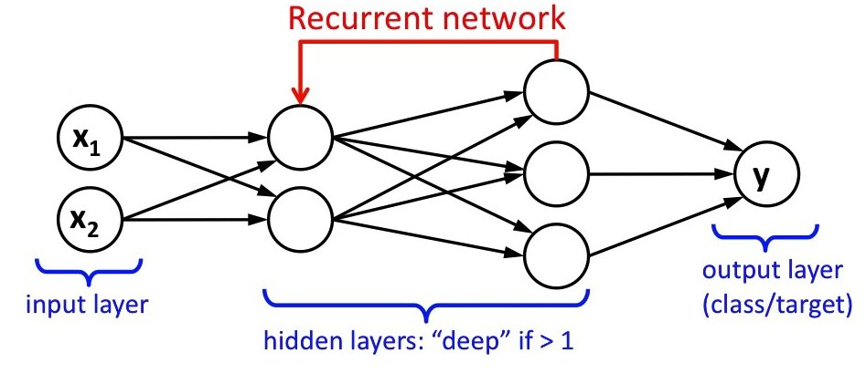

```{r xaringan-themer, include = FALSE}
library(xaringanthemer)
mono_light(
  base_color = "midnightblue",
  header_font_google = google_font("Josefin Sans"),
  text_font_google   = google_font("Montserrat", "500", "500i"),
  code_font_google   = google_font("Droid Mono"),
  link_color = "#8B1A1A", #firebrick4, "deepskyblue1"
  text_font_size = "28px"
)
```

## Recurrent neural networks (RNN)

- Fully connected networks and CNNs do not have memory - each input is processed independently

- While convolutional neural networks can efficiently process spatial information, recurrent neural networks are designed to better handle sequential information

- RNNs apply the same operation to each sequence element. The operation takes as input the memory of the previous sequence element and the new input. It updates the memory and optionally emits an output, which is either passed on to subsequent layers or is directly used as model predictions

---
## RNN applications

- Recurrent Neural Networks, or RNNs, were designed to work with sequence prediction problems, natural language processing
    - One-to-Many: An observation as input mapped to a sequence with multiple steps as an output
    - Many-to-One: A sequence of multiple steps as input mapped to class or quantity prediction
    - Many-to-Many: A sequence of multiple steps as input mapped to a sequence with multiple steps as output

.small[https://machinelearningmastery.com/when-to-use-mlp-cnn-and-rnn-neural-networks/

https://app.wandb.ai/wandb/huggingtweets/reports/HuggingTweets-Train-a-model-to-generate-tweets--VmlldzoxMTY5MjI
]

---
## Recurrent neural networks (RNN) 

.center[]

.small[https://leonardoaraujosantos.gitbooks.io/artificial-inteligence/recurrent_neural_networks.html]

---
## Recurrent neural networks (RNN) 

- RNNs are specifically designed to model space-temporal structures because they consider information from multiple previous layers. Most frequently used in time series, text, audio data analysis

- In the RNN model, the current hidden layer is a nonlinear function of both the previous layer(s) and the current input (x). The model has memory since it has a bias based on the "past"

.center[]

---
## Recurrent neural networks (RNN) 

Scheme of recurrent neural networks (RNNs): The left part of the image (in colors) shows the whole network structure; whereas, the recursive structure of the network is shown in the right, where $x$ represents inputs, $h$ are the hidden layers, $o = Vh^{(t)} + b$ are the outputs, $y$ are the target variables, and $L$ is the loss function.

.center[]

.small[https://www.analyticsvidhya.com/blog/2020/04/comprehensive-popular-deep-learning-interview-questions-answers/]

---
## RNN mathematical definition

- The predicted output at time $t$, $\hat{y}^{(t)}$, is a nonlinear function of $h^{(t)}$ and bias $b_1$, where $V$ is a weight matrix

$$\hat{y}^{(t)} = g(V h^{(t)} + b_1 )$$
- The current hidden layer $h^{(t)}$ is a nonlinear function of the previous layer $h^{(t - 1)}$ of the current input $(x)$ and of bias, $b_0$
$$h^{(t)} = f(W h^{(t - 1)} + Ux^{(t)} + b_0) \ (a)$$

- $W$ and $U$ are weight matrices to be estimated. If $x$ represents a sequence-like dataset, $x^{(t)}$ refers to the value of $x$ at time $t$ 

---
## Word-level RNN language model

.center[]

.small[https://d2l.ai/chapter_recurrent-neural-networks/rnn.html]

---
## Backpropagation through time

- Backpropagation through time requires to expand the recurrent neural network one timestep at a time to obtain the dependencies between model variables and parameters
- Then, based on the chain rule, we apply backpropagation to compute and store gradients
- Since sequences can be rather long, the dependency can be rather lengthy

A number of methods have been proposed to address this. One of the earliest is Long Short Term Memory (LSTM) [Hochreiter & Schmidhuber, 1997]. Gated Recurrent Unit (GRU) [Cho et al., 2014] is a slightly more streamlined variant that often offers comparable performance and is significantly faster to compute. 

.small[https://d2l.ai/chapter_recurrent-neural-networks/bptt.html]

---
## RNN improvements

- Sequence elements are not created equal - some may be more important than the other. E.g., introductory words may be highly predictive of a future story. Need _memory cell_ to store such information

- Some elements may be not important at all, e.g., HTML formatting tags around the actual text. Need _skipping mechanism_ to forget such elements

- Some parts of the sequence may be disjoint, e.g., book chapters. Need _reset_ mechanism to refresh internal state representations

---
## Gated Recurrent Units (GRU)

- Gated recurrent neural networks are better at capturing dependencies for time series with large timestep distances

- Reset gates help capture short-term dependencies in time series

- Update gates help capture long-term dependencies in time series

- GRUs contain basic RNNs as their extreme case whenever the reset gate is switched on. They can ignore sequences as needed

.small[https://d2l.ai/chapter_recurrent-modern/gru.html]

---
## Gated Recurrent Units (GRU)

.center[]

.small[https://d2l.ai/chapter_recurrent-modern/gru.html]

---
## Long Short-Term Memory (LSTM)

- One major issue with RNN is that although it should theoretically be able to retain at time t information about inputs seen many timesteps before, in practice, such long-term dependencies are impossible to learn due to vanishing gradient problem

- LSTM allows past information to be reinjected at a later time, thus fighting the vanishing-gradient problem

- LSTM’s design is slightly more complex than GRU but predates GRU by almost two decades

---
## Long Short-Term Memory (LSTM)

LSTM neuron has four mechanisms: 1) Forget, 2) Store, 3) Update, 4) Output

.center[]

.small[https://d2l.ai/chapter_recurrent-modern/lstm.html]

---
## Long Short-Term Memory (LSTM)

- LSTMs have three types of gates: input gates, forget gates, and output gates which control the flow of information

- The hidden layer output of LSTM includes hidden states and memory cells. Only hidden states are passed into the output layer. Memory cells are entirely internal

- LSTMs can cope with vanishing and exploding gradients

.small[https://d2l.ai/chapter_recurrent-modern/lstm.html]

---
## Deep Recurrent Neural Networks

- A single unidirectional hidden layer in LSTMs and GRUs may be insufficient to capture the full complexity of sequences. Several strategies to increase the flexibility
    - Add nonlinearity to the gating mechanisms
    - Increase the number of units in the hidden layer
    - Stack multiple layers on top of each other. The intermediate layers should return the full sequence of outputs (hidden state information), not the outputs at the last time step. Highly computationally intensive

---
## Bidirectional Recurrent Neural Networks

- Bidirectional RNN looks at its input sequence both ways, obtaining potentially richer representations and capturing patterns that may have been missed by the chronological-order version alone

- In bidirectional recurrent neural networks, the hidden state for each timestep is simultaneously determined by the data prior to and after the current timestep

- Bidirectional RNNs are exceedingly slow due to they require both a forward and a backward pass and that the backward pass is dependent on the outcomes of the forward pass. Hence, gradients will have a very long dependency chain

---
## Bidirectional Recurrent Neural Networks

.center[]

.small[https://d2l.ai/chapter_recurrent-modern/bi-rnn.html]
 
---
## Overfitting in RNNs

- Dropout - the same dropout mask (the same pattern of dropped units) should be applied at every timestep, instead of a dropout mask that varies randomly from timestep to timestep
    - Every recurrent layer in Keras has two dropout-related arguments: dropout, a float specifying the dropout rate for input units of the layer, and recurrent_dropout, specifying the dropout rate of the recurrent units

---
## CNNs for sequence processing

- CNNs extract features from local input patches, which can be time periods, sequence chunks
    - Not sensitive to time order

- Much faster than RNNs, but inferior performance
    - Use a 1D convnet as a preprocessing step before an RNN

- Used for machine translation (sequence-to-sequence), document classification, spelling correction

---
## 1D convolution

- Use 1D convolutions, extracting local 1D patches (sub-sequences) from sequences
- The convnet will turn the long input sequence into much shorter (downsampled) sequences of higher-level features

.center[]

---
## 1D pooling

- CNNs for sequence processing have a similar structure like regular convnets - they consist of stacks of layer_conv_1ds and layer_ max_pooling_1ds, ending in a global pooling operation or flattening operation

- 1D pooling extracts 1D patches (subsequences) from the input and outputs the maximum value (max pooling) or average value (average pooling)

- For 2D convnets, we used kernel size equal to 3, so a $3 \times 3$ convolution window contains 9 feature vectors. For 1D, we use one dimension, so our window size (kernel) can be 7 or 9

---
## RNNs vs. 1D convnets

- If global order matters in your sequence data, then it’s preferable to use a recurrent network. This is typically the case for time series, where the recent past is likely to be more informative than the distant past

- If global ordering isn’t fundamentally meaningful, then 1D convnets will turn out to work at least as well and are cheaper. This is often the case for text data, where a keyword found at the beginning of a sentence is just as meaningful as a keyword found at the end

