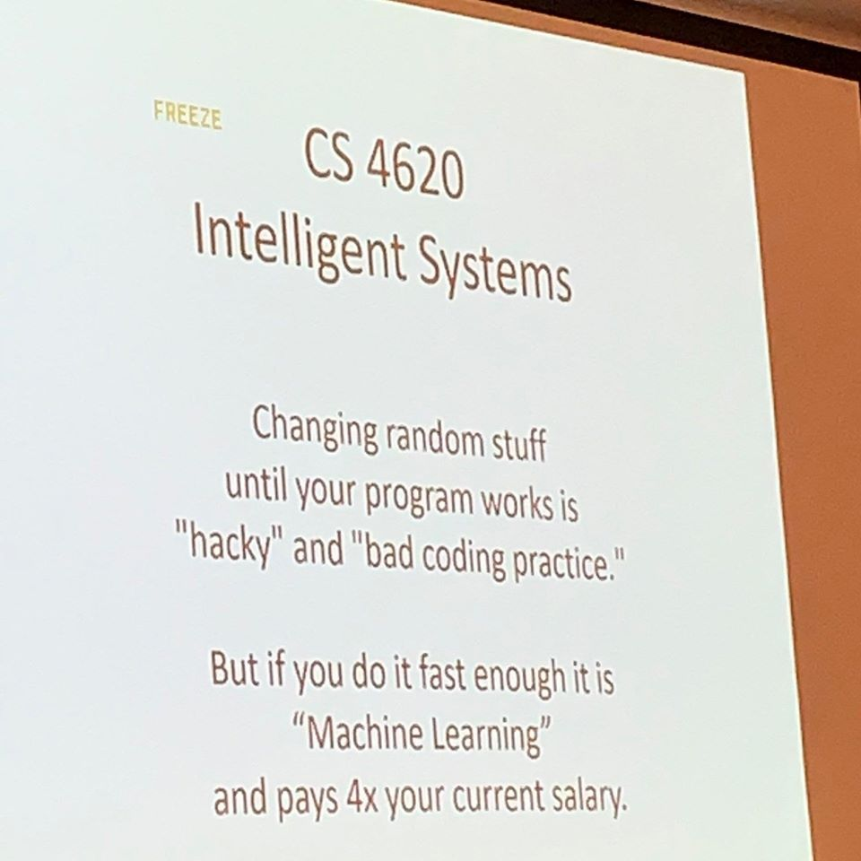

```{r xaringan-themer, include = FALSE}
library(xaringanthemer)
mono_light(
  base_color = "midnightblue",
  header_font_google = google_font("Josefin Sans"),
  text_font_google   = google_font("Montserrat", "500", "500i"),
  code_font_google   = google_font("Droid Mono"),
  link_color = "#8B1A1A", #firebrick4, "deepskyblue1"
  text_font_size = "28px"
)
```

## DL terminology 1

- **Activation function** - The mathematical function $f$ that produces neuron’s output $f(weight * input + bias)$.
- **Backpropagation** - An efficient algorithm to compute the loss, it propagates the error at the output layer level backward.
- **Batch** - In stochastic gradient descent (SGD) algorithm, each of the sample partitions within a given epoch.
- **Convolution** - Mathematically, a convolution is defined as an "integral transform" between two functions, where one of the functions must be a kernel. The discrete version of the operation is simply the weighting sum of several copies of the original function (f) shifting over the kernel.
- **Convolutional neural network** - A CNN is a special case of neural networks that uses convolution instead of full matrix multiplication in the hidden layers. A typical CNN is made up of dense, fully connected layers and "convolutional layers".

---
## DL terminology 2

- **Dropout** - Dropout means that a given percentage of neurons output is set to zero. The percentage is kept constant, but the specific neurons are randomly sampled in every iteration. The goal of dropout is to avoid overfitting.
- **Early stopping** - An anti-overfitting strategy that consists of stopping the algorithm before it converges.
- **Epoch** - In SGD and related algorithms, an iteration comprising all batches in a given partition. In the next epoch, a
different partition is employed.
- **Kernel = Filter = Tensor** - In DL terminology, the kernel is a multidimensional array of weights.
- **Generative adversarial network (GAN)** - GANs are based on a simple idea: train two networks simultaneously, the generator (G), which defines a probability distribution based on the information from the samples, and the discriminator (D), which distinguishes data produced by G from the real data.

---
## DL terminology 3

- **Learning rate** - Specify the speed of gradient update.
- **Loss** - Loss function measures how differences between observed and predicted target variables are quantified.
- **Neuron** - The basic unit of a DL algorithm. A "neuron" takes as input a list of variable values ( $x$ ) multiplied by "weights" ( $w$ ) and, as output, produces a non-linear transformation $f(w*x + b)$ where $f$ is the activation function and $b$ is the bias. Both $w$ and $b$ need to be estimated for each neuron such that the loss is minimized across the whole set of neurons.
- **Neuron layer** - "Neurons" are arranged in layers, i.e., groups of neurons that take the output of previous group of neurons as input.
- **Multilayer perceptron (MLP)** - Multilayer perceptron network is one of the most popular NN architectures, which consists of a series of fully connected layers, called input, hidden, and output layers. The layers are connected by a directed graph.

---
## DL terminology 4

- **Optimizer** - An algorithm to find weights ( $w$ and $b$ ) that minimize the loss function. Most DL optimizers are based on stochastic gradient descent (SGD).
- **Pooling** - A pooling function substitutes the output of a network at a certain location with a summary statistic of the neighboring outputs. This is one of the crucial steps on the CNN architecture. The most common pooling operations are maximum, mean, and median.
- **Recurrent Neural Network (RNN)** - RNN architecture considers information from multiple previous layers. In an RNN, the current hidden layer is a nonlinear function of both the previous layer(s) and the current input (x). The model has memory since the bias term is based on the “past”. These networks can be used in temporal-like data structures.

---
## DL terminology 5

- **Stochastic gradient descent (SGD)** - An optimizing algorithm that consists of randomly partitioning the whole dataset into subsets called "batches" or "minibatches" and updates the gradient using only that data subset. The next batch is used in the next iteration.
- **Weight regularization** - An excess of parameters (weights, w) may produce the phenomenon called "overfitting", which means that the model adjusts to the observed data very well, but prediction of new unobserved data is very poor. To avoid this, weights are estimated subject to constraints, a strategy called "penalization" or "regularization". The two most frequent regularizations are the L1 and L2 norms, which set restrictions on the sum of absolute values of w (L1) or of the square values (L2).

---
## FINAL

.center[]

.small[https://www.aprogrammerlife.com/top-rated/cs-4620-intelligent-systems-738]